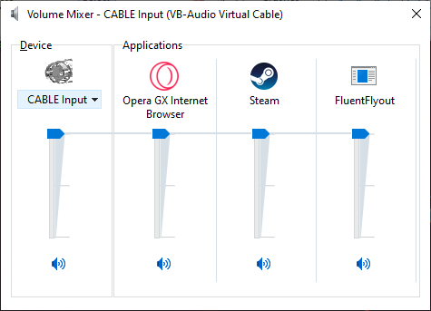
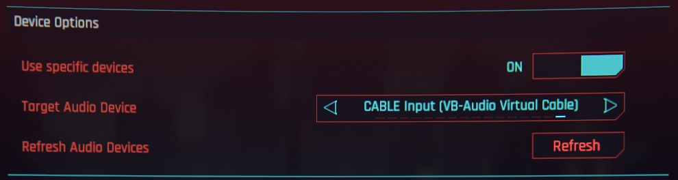
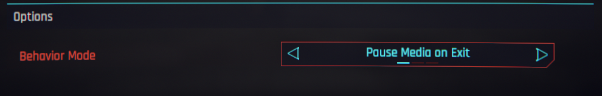
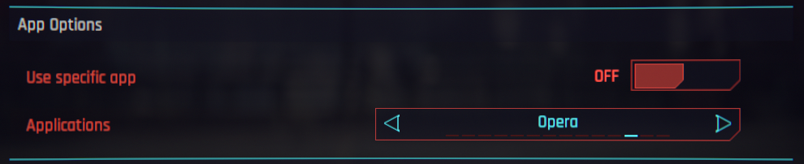

# Cyberpunk 2077 Improved External Radio
### based on [DrJackieBright's CP77-External-Radio-red4ext](https://github.com/DrJackieBright/CP77-External-Radio-red4ext/)

This mod is basically DrJackieBright's mod with more features.

## How this work
This mod can control current media that's playing and control its volume via "Window Volume Mixer" in other devices or current one.

# Features

## Volume Control
You can control the volume of specific devices and/or application with in-game radio volume.

[in-game radio menu](images/radioCut.png)

## Pause/Mute Behavior
You can choose whether it behave like the old radio or the new one.
- Pause on unmount from vehicles.
- Mute on unmount from vehicles.
- Do nothing

## Supported Applications (Not working.)
- Spotify
- Google Chrome
- Firefox
- Microsoft Edge
- VLC media player
- foobar2000
- Apple Music
- Tidal
- MusicBee
- Windows Media Player
- AIMP
- Opera
- Brave
- Discord

# Requirements
Only supported Windows (10/11)
Latest version of Cyberpunk 2077 (DLC not required)

# Installation
1. Install [redscript](https://www.nexusmods.com/cyberpunk2077/mods/1511), [RED4ext](https://www.nexusmods.com/cyberpunk2077/mods/2380), [Cyber Engine Tweaks](https://www.nexusmods.com/cyberpunk2077/mods/107), [Native Setting UI](https://www.nexusmods.com/cyberpunk2077/mods/3518).
2. Use [cybercmd](https://www.nexusmods.com/cyberpunk2077/mods/5176) if you're using redmod.
3. Unzip the file into your game directory or use Vortex to install.
4. Configure it in Native Setting UI.

# Compatibility
Not compatible with [DrJackieBright's CP77-External-Radio-red4ext](https://github.com/DrJackieBright/CP77-External-Radio-red4ext/) as I'm using his configuration.

# Troubleshoot
Make sure to update Visual C++ Redistributable on your system. [Link here](https://aka.ms/vs/17/release/vc_redist.x64.exe)

# Big thanks to
[DrJackieBright](https://github.com/DrJackieBright/CP77-External-Radio-red4ext/)'s CP77-External-Radio-red4ext for being an inspiration for me to create this mod in the first place.

[justarandomguyintheinternet](https://github.com/justarandomguyintheinternet/)'s Native UI Settings

[j4cekm4](https://github.com/jac3km4/)'s redscript

[wopss](https://github.com/wopss/)'s RED4ext

[maximegmd](https://github.com/maximegmd/)'s Cyber Engine Tweak

# License
See [License](https://github.com/Miiyuukii/CP2077.Improved.External.Radio/blob/master/LICENSE.md) tab for more information.

# AI Notices
I've used AI to help with coding, debugging process. Mostly on C++ side of things.
